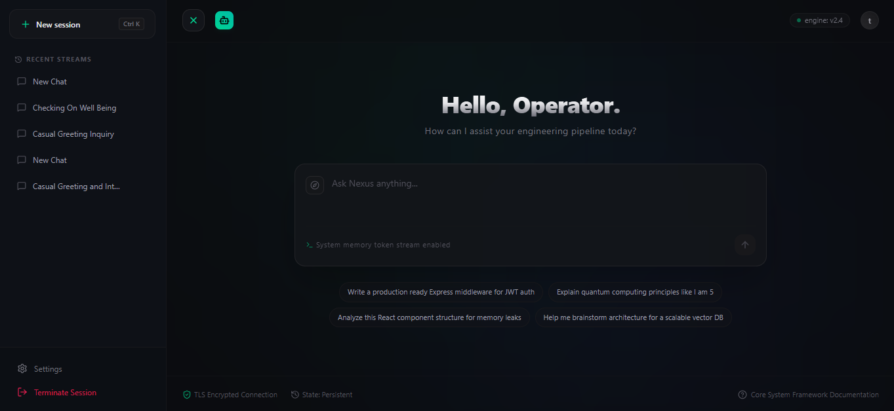
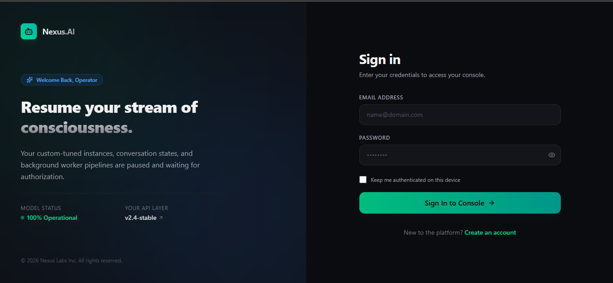
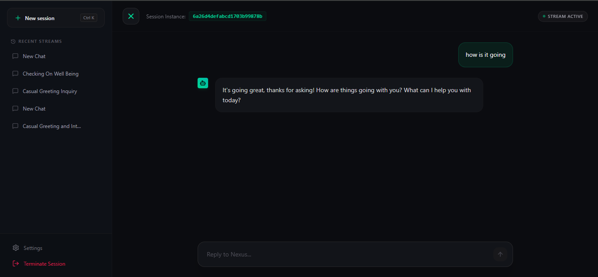

# 🔥 Nexus.ai | Intelligent Conversational Backbone

**Transforming Complex Logic into Intuitive Real-Time Conversations.**

[](YOUR_VERCEL_FRONTEND_URL)
[](https://github.com/shubham15554/Nexus.Ai)

---

## 💡 About Nexus.ai

Nexus.ai is not just another chatbot; it is a full-stack conversational intelligence platform. It bridges the gap between sophisticated Large Language Models (powered by Gemini API) and intuitive, real-time user experiences. 

Born out of a philosophy where deep logical thinking—honed through rigorous regional-language education—overcomes technical barriers, Nexus.ai is built to deliver fast, context-aware, and seamless interactions for developers, businesses, or curious minds.

### The "Nexus" Vision:
* **Central Intelligence Hub:** Acting as the "nexus" connecting various data streams and user requests.
* **Core Performance:** Prioritizing core logical accuracy and low latency above cosmetic fluff.
* **Accessible Power:** Making advanced AI conversations feel natural and accessible to everyone.

---

## 📸 Screenshots & UI Tour

<table width="100%">
  <tr>
    <td width="50%" align="center">
      
      <br/><b>📊 Central Dashboard</b>
    </td>
    <td width="50%" align="center">
      
      <br/><b>💬 Real-Time Chat Interface</b>
    </td>
  </tr>
  <tr>
    <td width="50%" align="center">
      
      <br/><b>🧠 Memory & Context Injection</b>
    </td>
    <td width="50%" align="center">
      
      <br/><b>📱 Mobile Responsive View</b>
    </td>
  </tr>
</table>

---

## 🛠️ Tech Stack: The Engine Under the Hood

Nexus.ai is a true MERN-stack powerhouse, engineered for production performance and security.

### Backend (Deployed on Render)
* **Node.js & Express.js:** Scalable server architecture.
* **MongoDB:** NoSQL database for flexible data modeling (user data, chat history).
* **Socket.io:** Powers the real-time, bi-directional event-based communication.
* **Gemini API (Google):** Integration with Google’s latest LLMs for advanced logical reasoning and content generation.
* **JSON Web Tokens (JWT) & Bcrypt:** Secure user authentication with robust password hashing.

### Frontend (Deployed on Vercel)
* **React & Vite:** A lightning-fast development experience and optimized production builds.
* **Tailwind CSS:** Fully custom, utility-first CSS framework for a responsive and modern UI.

---

## 🌟 Key Features & Bawal Logic

Here’s why Nexus.ai stands out as a serious engineering feat:

### 1. Enterprise-Grade Security & Authentication 🔒
* **Unified JWT Security Protocol:** Engineered an ironclad authentication layer where all critical REST APIs and HTTP routes are strictly locked behind JWT-verified middleware, preventing any unauthenticated data leaks.
* **Bi-Directional Socket.io Authentication:** Security doesn't stop at HTTP. Implemented secure connection-handshaking middleware on the WebSocket server, ensuring **only authenticated users** can establish socket connections and stream real-time chat data.
* **Production-Grade Cross-Origin Cookie Architecture:** Configured secure, multi-domain session management utilizing strict CORS parameters (`credentials: true`) combined with cross-site token transmission policies (`sameSite: 'none'`, `secure: true`). This ensures seamless, high-security state persistence between decoupled front-end (Vercel) and back-end (Render) ecosystems.

### 2. Real-Time Conversational Excellence 💬
* **Stream Active:** Seamlessly handled Socket.io events for continuous, real-time updates—no annoying page refreshes needed.

### 3. Short-Term Memory (STM) Implementation 🧠
* **Sliding Window Context:** Built an active short-term memory by fetching the last 10 sequential messages (`.limit(10)`) directly from MongoDB on every incoming message event, preserving chronological accuracy.
* **Dynamic State Mapping:** Automatically maps messages into standard LLM structured roles (`user` & `model`), ensuring the Gemini API maintains a clear, fluid grasp of immediate, conversational back-and-forth context.

### 4. Long-Term Memory (LTM) via Vector Embeddings 📂
* **Hybrid Retrieval-Augmented Generation (RAG):** Every single user message and AI response is split and transformed into semantic vectors asynchronously (`generateVector`).
* **Cross-Session Context Injection:** Uses high-dimensional similarity matching via a `queryMemory` layer to retrieve the top 3 most semantically relevant conversational snippets from historical archives. These are dynamically prepended as `system` prompts (`This is a relevant context snippet from a previous user conversation...`), giving Nexus.ai true, permanent cross-session cognitive retention.

---

## 🚀 Live Demo & How to Use

Experience the bawal logic in action!

### 💻 [Click Here for Live Demo](YOUR_VERCEL_FRONTEND_URL)

**How to Use:**
1.  **Signup:** Create your account securely.
2.  **Dashboard:** Access your main command center.
3.  **Start Chatting:** Send complex logic questions and watch Nexus.ai break them down in real-time.
4.  **View Chat History:** Your previous sessions are saved and contextually accessible.

---

## 🛠️ Local Installation & Setup

Want to run Nexus.ai locally? Follow these steps:

**Prerequisites:**
* Node.js (v18+)
* npm
* A MongoDB Atlas account
* A Google Cloud project with the Gemini API enabled and an API key.

### 1. Clone the Repository
```bash
git clone [https://github.com/shubham15554/Nexus.Ai.git](https://github.com/shubham15554/Nexus.Ai.git)
cd Nexus.Ai